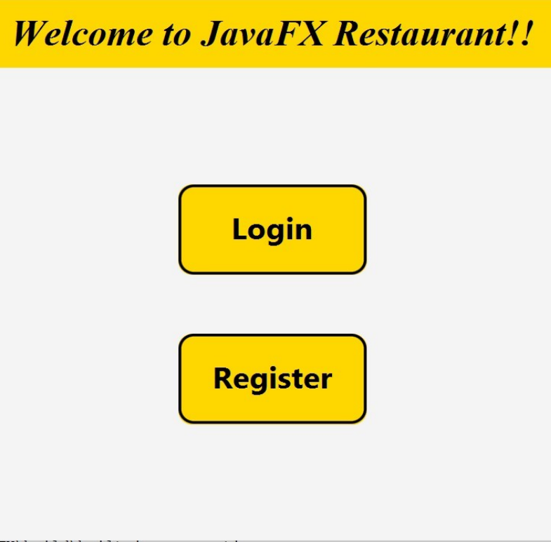
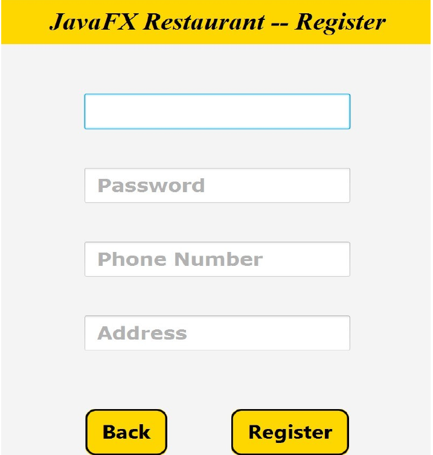
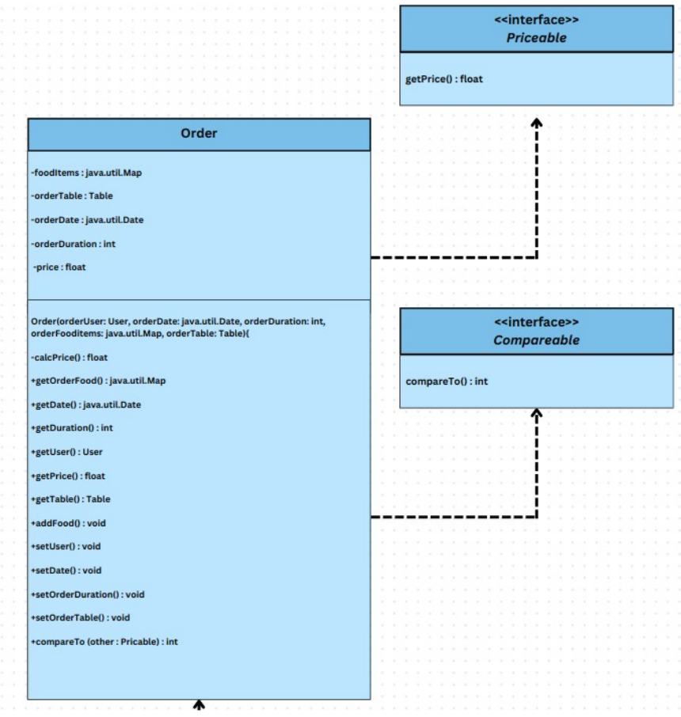

# JavaFX-Restaurant

Welcome Page              | Admin Info Page                   | User Order Page
:------------------------:|:---------------------------------:|:------------------------:
 |  | 

<!-- {{{Table of Contents --> 

## Table of Contents

* [Table of Contents](#table-of-contents)
* [Introduction](#introduction)
* [Technical Details](#technical-details)
* [Key User Features](#key-user-features)
* [Key Developer Features](#key-developer-features)
* [Project DEMO](#project-demo)
* [UML Diagram DEMO](#uml-diagram-demo)

<!-- }}} -->

<!-- {{{Introduction --> 
 

## Introduction

This Project is a Restaurant Management System Desktop Application made with Java & JavaFX. 
It is based on OOP Design Approach and utilizes lots of great features both regarding the developer and the user sides. 

 
<!-- }}} -->

<!-- {{{Technical Details --> 

## Technical Details

* Language : Java

* GUI : JavaFX

* Design Approach : Object Oriented Programming

* Database System : I/O File Operations

 
<!-- }}} -->

<!-- {{{Key User Features --> 
## Key User Features

* The application serves both the Owners and Customers of the Restaurant

* Owners Features :
    - Ability to manage Customers and Orders (e.g. number of customers and their information, details of the ongoing orders).
    - Ability to manage Stock and served Items (e.g. add/remove items from the menu, edit their prices and details).
    - Ability to check Restaurant's current state (e.g. reserved & free tables, dates of the ongoing bookings and reservations).

* Customers Features :
    - Ability to create a Customer's account with a unique Username and Password.
    - Ability to see the Menu items and their prices.
    - Ability to order food and book a table at a certain specified date.

 
<!-- }}} -->

<!-- {{{Key Developer Features --> 
## Key Developer Features

* Graphical User Interface (GUI) : The application boasts a visually appealing interface built with JavaFX, ensuring smooth navigation and a pleasant user experience.

* Input Sanitization : Robust input sanitization that ensures all user inputs are valid and can be processed safely throughout the application.

* Exception Handling : Error handling mechanisms are in place to manage unexpected scenarios, enhancing the application's reliability.

* OOP Design : Leverage of the main OOP Pillars such as Abstraction, Encapsulation, Inheritance, Polymorphism.

 
<!-- }}} -->

<!-- {{{Project DEMO --> 

## Project-DEMO

### Welcome Page :   

   

### Registration Page :   

   

### Login Page :   

   

### Admin Page :   

   

### Restaurant Information Page :   

   

### Customer Page :   

   

### Order Page :   

   

### Order Confirmation Page :   

   

### Input Sanitation :   
 
 
 
 
 
   

### Exception Handling :   
 
 
 
 
   

<!-- }}} -->

<!-- {{{UML Diagram DEMO --> 

## UML Diagram DEMO

 

### Restaurant Class UML :   

   

### Order Class UML :   

   

### FoodItem Class UML :   

   

### Table Class UML :   

   

### Restaurant's Hall Class UML :   

   

### User Class UML :   

  

<!-- }}} -->

